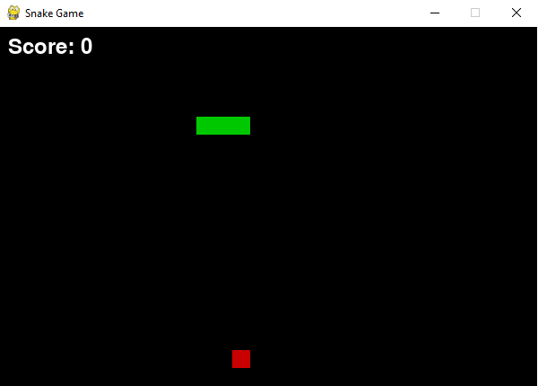

# Snake Game

Mini jeu Snake en Python avec Pygame pour montrer mes compétences en logique et programmation.

## Fonctionnalités

- Menu principal avec navigation flèches + Enter
- Game Over avec score et option pour rejouer
- Vitesse progressive du serpent
- Sons pour manger la pomme et Game Over

## Installation

1. Cloner le dépôt :
git clone https://github.com/ton-github/snake-game.git

2. Créer et activer une venv :
python -m venv venv
source venv/bin/activate # Mac/Linux
venv\Scripts\activate # Windows

3. Installer Pygame :
pip install -r requirements.txt

4. Lancer le jeu :
python game.py

## Screenshot

